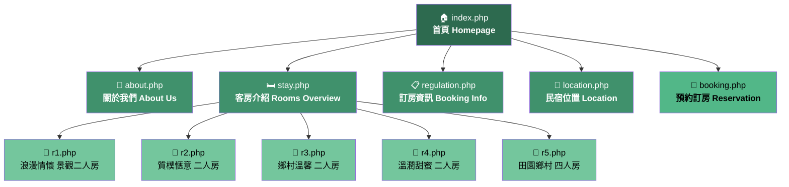
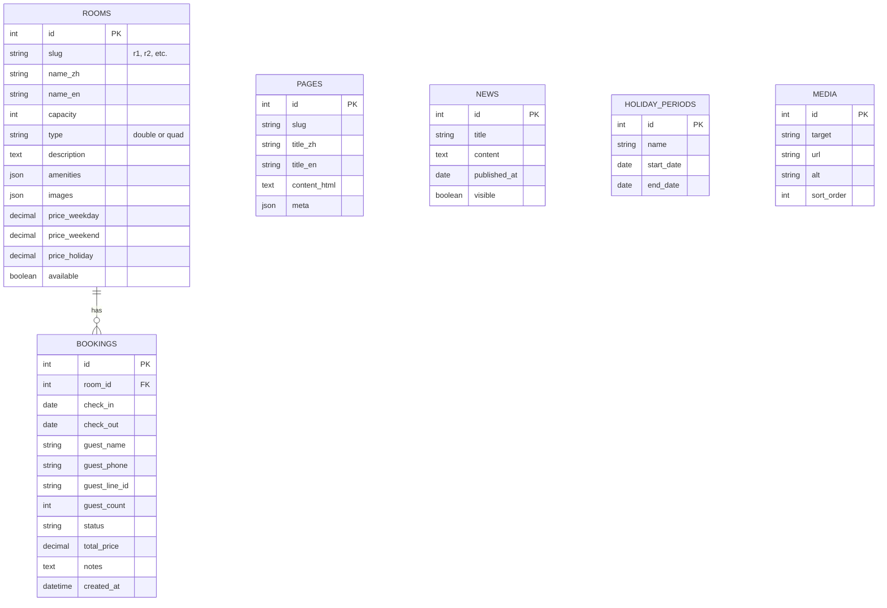

# 86.88 民宿 — Complete Website Mapping

> Source: `https://8688bnb.ylminsu.com.tw/`
> Owner: 黃筵丰 (黃先生) · ☎ 0920-900-793 · LINE: @gps2290j

> Current implementation note (2026-06-19): this file is a legacy-site discovery map, not the source of truth for the current app. Current runtime/API/deploy details live in `PROJECT_OVERVIEW.md`, `ARCHITECTURE.md`, `API_STATUS.md`, `ROADMAP.md`, and `DEPLOY.md`.

---

## 1. Sitemap — All Discovered Pages



### URL Pattern

All pages follow `index.php?page=<page>.php` — a classic PHP include pattern. The `index.php` acts as a shell/layout that injects child pages via the `page` query parameter.

| # | Page Slug | Chinese Name | English Label | URL |
|---|-----------|-------------|---------------|-----|
| 1 | `index.php` (no param) | 首頁 | Homepage | `index.php` |
| 2 | `about.php` | 關於我們 | About Us | `index.php?page=about.php` |
| 3 | `stay.php` | 客房介紹 | Rooms Overview | `index.php?page=stay.php` |
| 4 | `regulation.php` | 訂房資訊 | Booking Info / Rules | `index.php?page=regulation.php` |
| 5 | `location.php` | 民宿位置 | Location / Map | `index.php?page=location.php` |
| 6 | `booking.php` | 預約訂房 | Reservation Form | `index.php?page=booking.php` |
| 7 | `r1.php` | 浪漫情懷 景觀二人房 | Room 1 Detail | `index.php?page=r1.php` |
| 8 | `r2.php` | 質樸愜意 二人房 | Room 2 Detail | `index.php?page=r2.php` |
| 9 | `r3.php` | 鄉村溫馨 二人房 | Room 3 Detail | `index.php?page=r3.php` |
| 10 | `r4.php` | 溫潤甜蜜 二人房 | Room 4 Detail | `index.php?page=r4.php` |
| 11 | `r5.php` | 田園鄉村 四人房 | Room 5 Detail | `index.php?page=r5.php` |

> **Total: 11 pages** (1 homepage + 4 section pages + 1 booking page + 5 room detail pages)

---

## 2. Shared UI Components (present on every page)

### 2.1 Top Bar / Header
- Brand tagline: **「歡迎蒞臨入住」**
- Three CTA buttons:
  - `RESERVE` → links to `booking.php`
  - `MAIL 洽詢` → email (Cloudflare email-protected)
  - `ONLINE 預約` → LINE: `@gps2290j`

### 2.2 Navigation Menu
Appears twice (likely mobile hamburger + desktop nav):

| Order | Label | Link |
|-------|-------|------|
| 1 | 關於我們 | `about.php` |
| 2 | 客房介紹 | `stay.php` |
| 3 | 訂房資訊 | `regulation.php` |
| 4 | 民宿位置 | `location.php` |
| 5 | LINE 訂房 | External LINE link |

### 2.3 Footer
Contains two sections:

**Contact info:**
- Email (Cloudflare-protected)
- LINE: `@gps2290j`

**FOLLOW US — External links:**

| Label | URL | Type |
|-------|-----|------|
| FACEBOOK | `facebook.com/86.88bnb/` | Social |
| LINE | LINE `@gps2290j` | Social |

---

## 3. Page-by-Page Content Breakdown

### 3.1 🏠 Homepage (`index.php`)

| Section | Content |
|---------|---------|
| Hero | Brand name **86.88民宿** with image carousel (4 slides detected) |
| Sections | Three highlight blocks: **8688**, **CATS**, **BNB** |
| News | **最新消息** section |
| Quick links | `ABOUT US` → about.php, `DETAIL` → stay.php |

> [!NOTE]
> The homepage emphasizes three brand pillars: the property itself (8688), cats (CATS — a unique selling point), and the B&B experience (BNB).

### 3.2 📖 About Us (`about.php`)

| Section | Content |
|---------|---------|
| Header | `ABOUT US` / `關於我們` |
| Body | About text (mostly image-based, text not fully extractable via scrape — likely rendered as images on the original site) |

### 3.3 🛏️ Rooms Overview (`stay.php`)

| Section | Content |
|---------|---------|
| Header | `STAY` / `86.88 HOUSE` |
| Room list | 5 rooms with thumbnail + link to detail page |

**Room Inventory:**

| Room ID | Name (Chinese) | Type | Capacity | Detail Page |
|---------|----------------|------|----------|-------------|
| R1 | 浪漫情懷 景觀二人房 | Scenic Double | 2 pax | `r1.php` |
| R2 | 質樸愜意 二人房 | Simple Double | 2 pax | `r2.php` |
| R3 | 鄉村溫馨 二人房 | Country Double | 2 pax | `r3.php` |
| R4 | 溫潤甜蜜 二人房 | Warm Double | 2 pax | `r4.php` |
| R5 | 田園鄉村 四人房 | Country Quad | 4 pax | `r5.php` |

> **Total capacity: 4 double rooms + 1 quad room = max 12 guests**

### 3.4 🏡 Room Detail Pages (`r1.php` – `r5.php`)

All 5 room detail pages share the same layout:

| Section | Content |
|---------|---------|
| Header | `ROOM` / `86.88 HOUSE` |
| Gallery | Photo gallery/carousel of room images |
| CTAs | Email, LINE, `BOOKING` button → `booking.php` |

### 3.5 📋 Booking Info (`regulation.php`)

| Section | Content |
|---------|---------|
| Header | `RESERVATION` / `訂房資訊` |
| Body | Rules, pricing, policies (image-rendered content) |

> [!IMPORTANT]
> The regulation/pricing info is likely rendered as images — we'll need to manually transcribe or get this data from the owner to build a proper digital version.

### 3.6 📍 Location (`location.php`)

| Section | Content |
|---------|---------|
| Header | `LOCATION` / `86.88民宿位置` |
| Body | Map embed (likely Google Maps) + contact info |

### 3.7 📅 Booking (`booking.php`)

| Section | Content |
|---------|---------|
| Body | Appears to be an embedded booking form or external widget |

> [!NOTE]
> The booking page had minimal extractable content — likely an iframe embed from a third-party service or the ylminsu.com.tw platform.

---

## 4. Tech Stack & Infrastructure Analysis

### 4.1 Current Site (Legacy)

| Aspect | Current | Observations |
|--------|---------|--------------|
| **Backend** | PHP | Classic `index.php?page=X` include pattern |
| **Hosting** | ylminsu.com.tw platform | ⚠️ 寄生在人家系統，老闆不想依賴別人 |
| **CDN/Security** | Cloudflare | Email protection enabled, CDN active |
| **Booking** | Platform-provided | Likely ylminsu.com.tw built-in system |
| **Content format** | Heavy image usage | Most text is baked into images → not SEO-friendly |
| **Mobile** | Responsive (dual nav) | Has mobile hamburger menu + desktop nav |
| **Analytics** | Unknown | No visible analytics tags in HTML |

### 4.2 推薦最終架構（適合民宿）

```
旅客
 ↓
https://8688bnb.com
 ↓
Cloudflare (CDN + SSL + DDoS Protection)
 ↓
Cloudflare Tunnel (Zero Trust)
 ↓
Synology NAS (192.168.1.100)
 ↓
Docker (Container Manager)
 ↓
Nginx Proxy Manager (Reverse Proxy GUI)
 ↓
Website Container (Next.js)
```

> [!IMPORTANT]
> **絕對不要** 直接把 NAS Port Forward 到外網（例如 443 → NAS），新手容易被掃。
> **正確做法**：用 Cloudflare Tunnel，NAS 主動連 Cloudflare Zero Trust，不用固定 IP、不用公開 IP、不用 Port Forward。

### 4.3 網域策略

**必買網域。**

| 推薦 | 不推薦 |
|------|--------|
| `8688bnb.com` (自己的網域) | `ylminsu.com.tw/別人的子路徑` |

**去哪買：Cloudflare Registrar**
- 便宜（一年約 300~600 台幣）
- DNS 超強
- Tunnel 同 ecosystem
- SSL 免費

### 4.4 推薦 Docker 架構

```yaml
services:
  nginx-proxy-manager:    # Reverse Proxy GUI
  cloudflared:            # Cloudflare Tunnel
  website:                # Next.js 民宿網站
  admin:                  # Next.js 後台
  api:                    # Express REST API
  postgres:               # 訂房資料庫
  redis:                  # 快取
```

**Nginx Proxy Manager 路由規劃：**

| 網域 | 指向 |
|------|------|
| `8688bnb.com` | website container |
| `admin.8688bnb.com` | admin container |
| `api.8688bnb.com` | api container |

---

## 5. Contact & Brand Info Summary

| Field | Value |
|-------|-------|
| **Brand name** | 86.88 民宿 / 86.88 B&B |
| **Tagline** | 歐風質感精緻渡假｜貓咪陪伴 療癒人心 |
| **Location** | 宜蘭三星 (Sanxing, Yilan), near 安農溪畔 |
| **Owner** | 黃筵丰 (黃先生 / Mr. Huang) |
| **Phone** | 0920-900-793 |
| **LINE** | @gps2290j |
| **Facebook** | facebook.com/86.88bnb/ (1,089 likes) |
| **Email** | Cloudflare-protected (need to obtain directly) |

---

## 6. Data Model (CMS / database)



---

## 7. 實際部署步驟（真正流程）

### Phase 1：NAS 初始化

| Step | 動作 | 備註 |
|------|------|------|
| 1 | NAS 接 Router LAN（用有線） | 穩定 |
| 2 | 進 Synology DSM：`http://NAS_IP:5000` | 初始設定 (環境紀錄：DS220+ / DSM 7.2.2) |
| 3 | 建立 admin account、RAID1、Shared Folder | 基礎配置 |
| 4 | 固定 NAS IP（例如 `192.168.1.100`） | 去 router 設 DHCP reservation |

### Phase 2：Docker 環境（歷史分期命名）

| Step | 動作 | 備註 |
|------|------|------|
| 5 | 安裝 Container Manager | Synology 官方 Docker |
| 6 | 開 SSH（DSM → 控制台 → Terminal → Enable SSH） | 遠端管理 |
| 7 | 電腦 SSH 進 NAS：`ssh user@192.168.1.100` | 開始操作 |

### Phase 3：買網域

| Step | 動作 | 備註 |
|------|------|------|
| 8 | 去 Cloudflare Dashboard 買 `8688bnb.com` | 一年約 300~600 台幣 |

### Phase 4：Cloudflare Tunnel

| Step | 動作 | 備註 |
|------|------|------|
| 9 | 進 Cloudflare Zero Trust → 建立 Tunnel | 取得 token |
| 10 | Cloudflare 會給你 `docker run cloudflared ...` | 記下 token |
| 11 | 在 NAS 建 `docker-compose.yml`，跑 cloudflared + nginx proxy manager + website | 核心部署 |

### Phase 5：Reverse Proxy

| Step | 動作 | 備註 |
|------|------|------|
| 12 | 部署 Nginx Proxy Manager（GUI 管理） | 超推薦 |

部署後可設定：

| 網域 | 指向 |
|------|------|
| `8688bnb.com` | website |
| `admin.8688bnb.com` | 後台 |
| `api.8688bnb.com` | API |

### Phase 6：網站本體

**最推薦：Next.js**

原因：SEO 強、圖片優化、Google 搜尋友善、很適合民宿。

#### 頁面規劃

| 頁面 | 內容 |
|------|------|
| **首頁** | Hero image、民宿特色（貓咪、歐風）、CTA |
| **房型頁** | 照片 gallery、價格、人數、設備 |
| **相簿** | 民宿環境、貓咪、周邊景點 |
| **地圖** | 嵌入 Google Maps、交通指引 |
| **聯絡頁** | LINE、電話、Email |
| **訂房頁** | 日期選擇、房型選擇、人數選擇 → LINE 確認 |

---

## 8. 訂房策略（超重要）

> [!IMPORTANT]
> **一開始不要自做金流，超麻煩。**

### 第一版訂房流程

```
網站展示 → 「立即訂房」按鈕 → 訂房互動頁面 → LINE 官方帳號 → 人工確認
```

### 訂房互動頁面（Phase 1 就做）

目前網站訂房頁為測試階段：會串 API 查詢房況、估價並建立測試訂單，但頁面明確標示不視為有效訂房；正式確認仍需透過民宿主人電話或 LINE。

| 功能 | 說明 |
|------|------|
| 📅 日期選擇 | 入住 / 退房日期 picker |
| 🛏️ 房型選擇 | 5 間房的卡片式選擇 |
| 👥 人數選擇 | 大人 / 小孩人數 |
| 💰 預估價格 | 根據選擇即時顯示（平日/假日/連假） |
| 📋 摘要確認 | 選完後顯示預訂摘要 |
| 💬 送出至 LINE | 顯示即將複製的訊息，確認後複製並開啟 LINE |

> [!TIP]
> 目前不串金流。網站送出功能保留給測試與資料流驗證，真實訂房仍以主人確認、付款方式與實際房價為準。

---

## 9. 照片管理

民宿超吃照片。

**最佳實踐：**
- 格式：WebP（體積小、品質好）
- 壓縮：上傳前壓縮
- Lazy loading：滾動時才載入
- Next.js `<Image>` 元件：自動優化、響應式

---

## 10. 備份（一定做）

| 工具 | 用途 |
|------|------|
| Synology Snapshot | 快照還原 |
| Hyper Backup | 完整備份 |

**必須備份：**
- 網站原始碼
- DB（訂房資料）
- 圖片素材

---

## 11. 你真正會遇到的問題

| 問題 | 說明 | 解法 |
|------|------|------|
| **上傳頻寬弱** | 家用網路 upload 很慢 | 民宿網站流量通常小，OK |
| **停電** | NAS 會掛，資料可能炸 | 建議買 UPS |
| **ISP 限制** | CGNAT、擋 port | Cloudflare Tunnel 可解 |

---

## 12. Mapping: Original Site → New Site (Next.js)

```
Original Site (PHP)                    →  New Site (Next.js)
─────────────────────────────────────────────────────────────
index.php (no param)                   →  app/page.tsx (首頁)
index.php?page=about.php               →  app/about/page.tsx
index.php?page=stay.php                 →  app/rooms/page.tsx
index.php?page=r1.php                   →  app/rooms/r1/page.tsx
index.php?page=r2.php                   →  app/rooms/r2/page.tsx
index.php?page=r3.php                   →  app/rooms/r3/page.tsx
index.php?page=r4.php                   →  app/rooms/r4/page.tsx
index.php?page=r5.php                   →  app/rooms/r5/page.tsx
index.php?page=regulation.php          →  app/booking-info/page.tsx
index.php?page=location.php            →  app/location/page.tsx
index.php?page=booking.php             →  app/booking/page.tsx (互動訂房頁)

Shared Components:
  header (top bar + nav)                →  components/Header.tsx
  footer (follow us + contact)          →  components/Footer.tsx

Assets:
  room images (need from owner)         →  public/images/rooms/
  brand logo                            →  public/images/logo.*
  cat photos                            →  public/images/cats/

Data:
  room info (JSON)                      →  data/rooms.json
  news items (JSON)                     →  data/news.json
  site config (JSON)                    →  data/config.json
```

---

## 13. 最推薦的第一版

> [!TIP]
> **不要太複雜。第一版做好這些就已經很專業了。**

### 第一版 = Next.js 靜態網站 + Cloudflare Tunnel + LINE 訂房

| 項目 | 內容 |
|------|------|
| 🏠 首頁 | Hero image + 民宿特色 + CTA |
| 🛏️ 房型展示 | 5 間房照片 + 價格 + 人數 |
| 📅 訂房互動頁 | 日期/房型/人數 選擇 UI → 導到 LINE |
| 📍 地圖 | Google Maps 嵌入 |
| 📞 聯絡 | LINE + 電話 + Email |
| 🔒 部署 | Cloudflare Tunnel → NAS → Docker |

### 後續擴充：全方位訂房與內容管理

在既有 admin/API 基礎上，後續仍可持續擴充以下能力：

| 項目 | 說明 |
|------|------|
| **訂房 API 與 UI/UX** | 建立完整的線上訂房流程，提供流暢的預約體驗與後端 API 支援。 |
| **圖片與儲存管理** | 優化首頁 Gallery 等各頁面的圖片顯示，並建立完善的圖片儲存與管理機制。 |
| **Admin 後台 (CMS)** | 已可登入管理公告、房型、圖片、訂單與可訂狀態，後續可強化頁面內容編輯。 |
| **訂單行事曆 (Calendar)** | 已有房型日期格狀檢視與列表檢視，後續可加強拖曳、匯出與篩選。 |
| **OTA 平台同步 (Webhooks)**| 建立 Webhook 接收 Agoda、Booking.com 等平台的通知，自動同步房態與訂單。 |
| **金流串接** | 綠界/LINE Pay 線上支付。 |
| **LINE/Email 通知** | 新訂單自動通知老闆與旅客。 |
